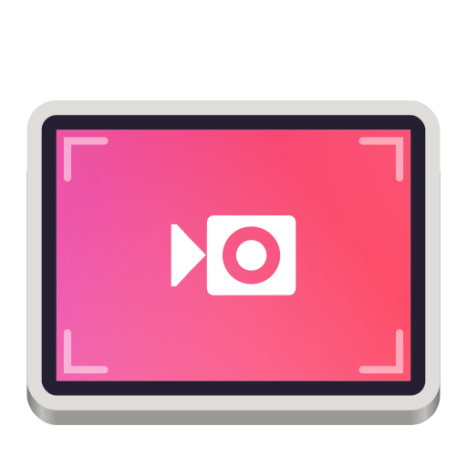
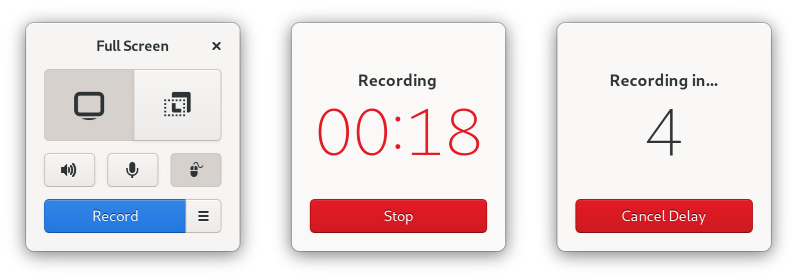

<h1 align="center">
  <br>
  Kooha
</h1>

<p align="center"><strong>Elegantly record your screen</strong></p>

<p align="center">
  <a href="https://flathub.org/apps/details/io.github.seadve.Kooha"></a>
</p>

<br>
<p align="center">
  <a href="https://liberapay.com/SeaDve/">
    
  </a>
  <a href="https://hosted.weblate.org/engage/kooha/">
    
  </a>
  <a href="https://github.com/SeaDve/Kooha/actions/workflows/testing.yml">
    
  </a>
</p>

<p align="center">
  
</p>

Capture your screen in a straightforward and painless way without distractions.

Kooha is a simple screen recorder with a minimal interface. You can simply click
the record button without having to configure a bunch of settings.

The main features of Kooha include the following:
* 🎥 Capture your screen without any hassle.
* 🎙️ Record your microphone, computer sounds, or both at the same time.
* 🖼️ Select an area of your screen to record.
* ⏲️ Set delay to prepare before you start recording.
* 📼 Support for the free Matroska and WebM formats.
* 🖱️ Hide or show mouse pointer.
* 💾 Choose a saving location for your recording.
* ⌨️ Utilize helpful keyboard shortcuts.


## 🛣️ Roadmap

- [ ] MP4 video format support (Already in dev branch)
- [ ] Change backend to support individual window or monitor recording
- [ ] Other desktop environments support


## ⚙️ Hidden Configuration Options

### Change frames per second to 60fps

You can copy and paste this to the terminal if you installed Kooha as a flatpak:

`flatpak run --command=gsettings io.github.seadve.Kooha set io.github.seadve.Kooha video-frames 60`<br/> 
or `gsettings set io.github.seadve.Kooha video-frames 60` if installed locally.

Take note that using other frames per second may cause flickering, depending on
the performance of your device. 


## 🏗️ Building from source

### GNOME Builder
GNOME Builder is the environment used for developing this application. 
It can use Flatpak manifests to create a consistent building and running 
environment cross-distro. Thus, it is highly recommended you use it.

1. Download [GNOME Builder](https://flathub.org/apps/details/org.gnome.Builder).
2. In Builder, click the "Clone Repository" button at the bottom, using `https://github.com/SeaDve/Kooha.git` as the URL.
3. Click the build button at the top once the project is loaded.

### Meson
```
git clone https://github.com/SeaDve/Kooha.git
cd Kooha
meson builddir --prefix=/usr/local
ninja -C builddir install
```


## 🙌 Help translate Kooha
You can help Kooha translate into your native language. If you found any typos 
or think you can improve a translation, you can use the [Weblate](https://hosted.weblate.org/engage/kooha/) platform.


## ☕ Support me and the project

Kooha is free and will always be for everyone to use. If you like the project and
would like to support and fund it, you may donate through [Liberapay](https://liberapay.com/SeaDve/).


## 💝 Acknowledgment

[RecApp](https://github.com/amikha1lov/RecApp) greatly inspired the creation of Kooha. 
And also, a warm thank you to all the [contributors](https://github.com/SeaDve/Kooha/graphs/contributors) 
and [translators](https://hosted.weblate.org/engage/kooha/) from Weblate.
