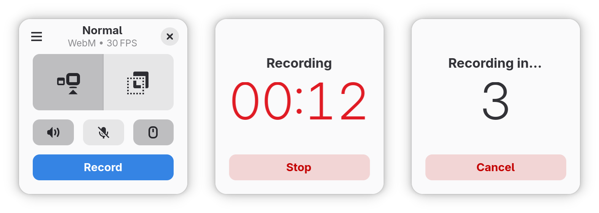

<h1 align="center">
  
  <br>
  Kooha
</h1>

<p align="center">
  <strong>Elegantly record your screen</strong>
</p>

<p align="center">
  <a href="https://flathub.org/apps/details/io.github.seadve.Kooha">
    
  </a>
  <br>
  <a href="https://liberapay.com/SeaDve/donate">
    
  </a>
</p>

<br>

<p align="center">
  <a href="https://hosted.weblate.org/engage/kooha/">
    
  </a>
  <a href="https://github.com/SeaDve/Kooha/actions/workflows/ci.yml">
    
  </a>
  <a href="https://flathub.org/apps/details/io.github.seadve.Kooha">
    
  </a>
  <a href="https://repology.org/project/kooha/versions">
    
  </a>
</p>

<p align="center">
  
</p>

Capture your screen in a intuitive and straightforward way without distractions.

Kooha is a simple screen recorder with a minimal interface. You can simply click
the record button without having to configure a bunch of settings.

The main features of Kooha include the following:
* 🎙️ Record microphone, desktop audio, or both at the same time
* 📼 Support for WebM, MP4, GIF, and Matroska formats
* 🖥️ Select a monitor, a window, or a portion of the screen to record
* 🗔 Multiple sources selection
* 🛠️ Configurable saving location, pointer visibility, frame rate, and delay
* 🚀 Experimental hardware-accelerated encoding


## 😕 It Doesn't Work

There are many possibilities on why it may not be working. You may not have
the runtime requirements mentioned below installed, or your distro doesn't
support it. For troubleshooting purposes the [screen cast compatibility page](https://github.com/emersion/xdg-desktop-portal-wlr/wiki/Screencast-Compatibility)
of `xdg-desktop-portal-wlr` wiki may be helpful in determining if your distro
has support for it out of the box. If it does, but it still doesn't work, you
can also check for the [troubleshooting checklist](https://github.com/emersion/xdg-desktop-portal-wlr/wiki/%22It-doesn't-work%22-Troubleshooting-Checklist).


## ⚙️ Experimental Features

These features are disabled default due to stability issues and possible
performance degradation. However, they can be enabled manually by running Kooha
with `KOOHA_EXPERIMENTAL` env var set to `1`. (e.g. `KOOHA_EXPERIMENTAL=1 flatpak run io.github.seadve.Kooha`).

### Enable hardware accelerated encoding and other encoders

Together with `KOOHA_EXPERIMENTAL` env var, it is also needed
to set `GST_VAAPI_ALL_DRIVERS` to `1` to enable the needed drivers.

Additionally, `gstreamer-vaapi`
is required to be installed on your system. If Kooha is installed through Flatpak,
it is as simple as running `flatpak install org.freedesktop.Platform.GStreamer.gstreamer-vaapi`
to install the package.

### Recording specific window

Due to flickering, this has been disabled by default, but can be enabled through
`KOOHA_EXPERIMENTAL` env var.


## 📋 Runtime Requirements

* pipewire
* gstreamer-plugin-pipewire
* xdg-desktop-portal
* xdg-desktop-portal-(e.g., gtk, kde, wlr)


## 🏗️ Building from source

### GNOME Builder

GNOME Builder is the environment used for developing this application.
It can use Flatpak manifests to create a consistent building and running
environment cross-distro. Thus, it is highly recommended you use it.

1. Download [GNOME Builder](https://flathub.org/apps/details/org.gnome.Builder).
2. In Builder, click the "Clone Repository" button at the bottom, using `https://github.com/SeaDve/Kooha.git` as the URL.
3. Click the build button at the top once the project is loaded.

### Meson

#### Prerequisites

The following packages are required to build Kooha:

* meson
* ninja
* appstream-glib (for checks)
* cargo
* x264 (for MP4)
* gstreamer
* gstreamer-plugins-base
* gstreamer-plugins-ugly (for MP4)
* gstreamer-vaapi (for hardware acceleration)
* glib2
* gtk4
* libadwaita

#### Build Instruction

```shell
git clone https://github.com/SeaDve/Kooha.git
cd Kooha
meson _build --prefix=/usr/local
ninja -C _build install
```


## 🙌 Help translate Kooha

You can help Kooha translate into your native language. If you found any typos
or think you can improve a translation, you can use the [Weblate](https://hosted.weblate.org/engage/kooha/) platform.


## ☕ Support me and the project

Kooha is free and will always be for everyone to use. If you like the project and
would like to support and fund it, you may donate through [Liberapay](https://liberapay.com/SeaDve/).


## 💝 Acknowledgment

[RecApp](https://github.com/amikha1lov/RecApp) greatly inspired the creation of Kooha.
And also, a warm thank you to all the [contributors](https://github.com/SeaDve/Kooha/graphs/contributors)
and [translators](https://hosted.weblate.org/engage/kooha/) from Weblate.
