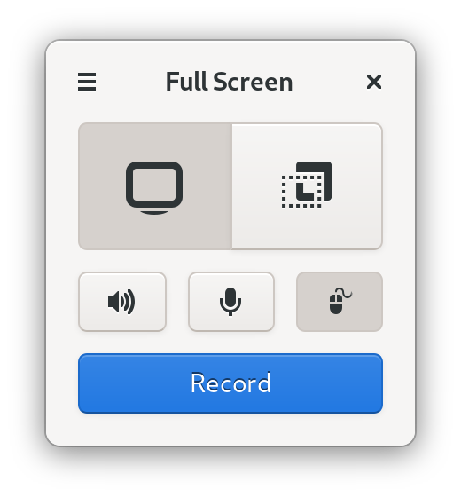
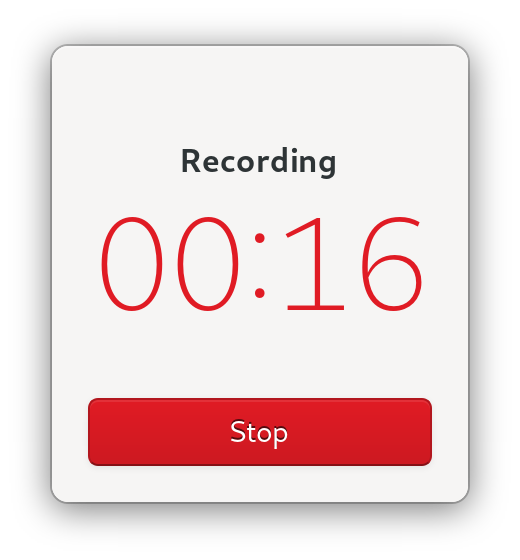
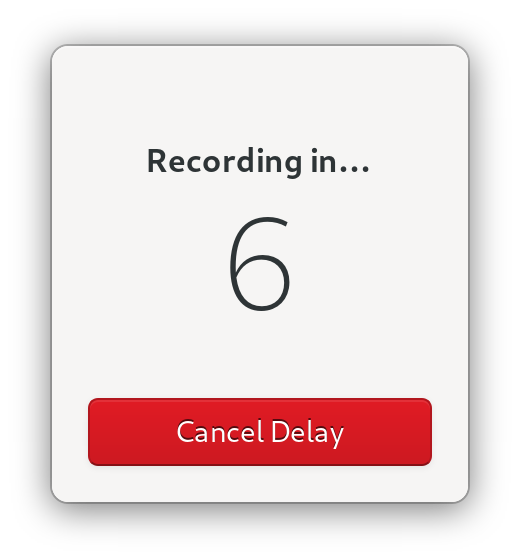

<h1 align="center">
	 
	Kooha
</h1>

<strong>Simple Screen Recorder</strong>

  

  

  

## Description
A simple screen recorder for GNOME Wayland

## Build from source

## Credits

Developed by **[Dave Patrick](https://github.com/SeaDve)**.
The [chime](https://soundbible.com/1598-Electronic-Chime.html) used is under the Public Domain.
