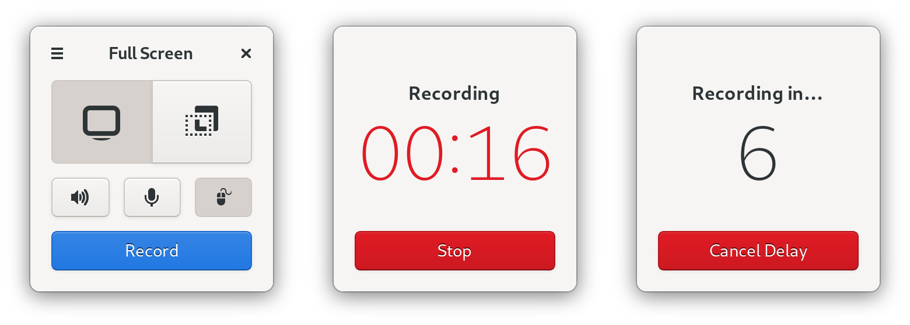

<h1 align="center">
	<br>
	Kooha
</h1>

<p align="center"><strong>Simple screen recorder</strong></p>

<p align="center">
  
</p>

## Description
A simple screen recorder for GNOME built with GTK and PyGObject. Kooha allows you to record your screen and also audio from your microphone or desktop.


## What is not yet working
* Some bugs in audio recording
* Video format settings
* Planned to support KDE


## Building from source

### GNOME Builder (Recommended)
GNOME Builder is the environment used for developing this application. It can use Flatpak manifests to create a consistent building and running environment cross-distro. Thus, it is highly recommended you use it.

1. Download [GNOME Builder](https://flathub.org/apps/details/org.gnome.Builder).
2. In Builder, click the "Clone Repository" button at the bottom, using `https://github.com/SeaDve/Kooha.git` as the URL.
3. Click the build button at the top once the project is loaded.


### Manual
```
git clone https://github.com/SeaDve/Kooha.git
cd Kooha
mkdir -p $HOME/Projects/flatpak/repo
flatpak-builder --repo=$HOME/Projects/flatpak/repo --force-clean --ccache build-dir io.github.seadve.Kooha.json
flatpak remote-add --no-gpg-verify local-repo $HOME/Projects/flatpak/repo
flatpak install local-repo io.github.seadve.Kooha
```


## Credits

Developed by **[Dave Patrick](https://github.com/SeaDve)**.

The [chime](https://soundbible.com/1598-Electronic-Chime.html) used is under the Public Domain.


## Donate
If you want to support development, consider donating via [PayPal](https://paypal.me/sedve).

